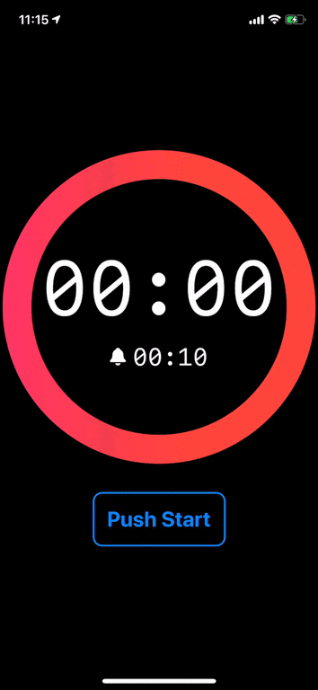

[![MIT License][license-shield]][license-url]

# CountdownRing
 
A SwiftUI implementation of countdown timer ring UI.

<p align="center">

</p>


## Requirements

- ✅ Xcode 11.3  
- ✅ Swift 5.1+
- ✅ iOS 13+

## Installation


`CountdownRing` is available via [Swift Package Manager](https://swift.org/package-manager).

Using Xcode 11, go to `File -> Swift Packages -> Add Package Dependency` and enter [https://github.com/yimajo/CountdownRing](https://github.com/yimajo/CountdownRing)  


## Usage

[demo project](/Demo/) included in this repo.

```swift
import SwiftUI
import CountdownRing

struct ContentView: View {
    @ObservedObject var countdownTimer: CountdownTimer

    var body: some View {
        VStack {
            ZStack {
                CountdownRingView(
                    countdownTimer: countdownTimer,
                    gradientColors: [.pink, .red],
                    lineWidth: 34
                )
                .padding(.bottom, 0.0)

                TimerTextView(countdownTimer: self.countdownTimer)
            }
            .frame(maxWidth: 400, maxHeight: 400)

            Button(action: {
                self.buttonAction()
            }) {
                Text(buttonTitle)
                    .fontWeight(.bold)
                    .font(.title)
                    .foregroundColor(.blue)
                    .padding()
                    .overlay(
                        RoundedRectangle(cornerRadius: 10)
                            .stroke(Color.blue, lineWidth: 2)
                    )
            }
            .frame(maxWidth: 180, maxHeight: 80)
        }
        .frame(maxWidth: .infinity, maxHeight: .infinity)
        .background(Color.black)
        .edgesIgnoringSafeArea(.all)
    }
}

private extension ContentView {

    func buttonAction() {
        switch countdownTimer.status {
        case .stop:
            countdownTimer.start()
        case .countdown:
            countdownTimer.reset()
        }
    }

    var buttonTitle: String {
        switch countdownTimer.status {
        case .stop:
            return "Push Start"
        default:
            return "Push Reset"
        }
    }
}

struct ContentView_Previews: PreviewProvider {
    static var previews: some View {
        ContentView(countdownTimer: CountdownTimer(limitTimeInteraval: 10))
    }
}
```


